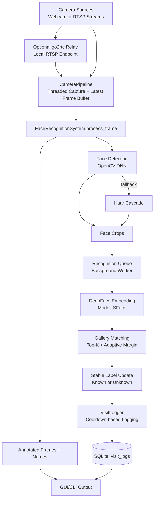
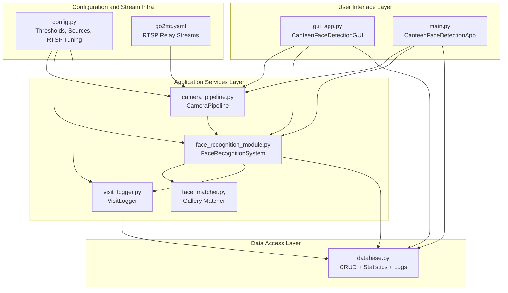

# Detailed Architecture and Database Design

This document reflects the current implementation in the codebase.

## 1. System Architecture (Runtime Flow)

### 1.1 End-to-End Flow



### 1.2 What Each Stage Does

- Camera input: `CameraPipeline` selects single or multiple sources from configuration.
- Capture reliability: threaded reads, reconnect logic, and stale-frame dropping are used for low-latency behavior.
- Detection: DNN detector is preferred; Haar cascade is used as fallback.
- Recognition: a background thread computes embeddings and matching to keep UI responsive.
- Matching: gallery-based comparison is used (multiple stored embeddings per user), not only one average vector.
- Logging: known detections are logged with cooldown; visit records are persisted in SQLite.

### 1.3 Operational Notes (Implementation-Accurate)

- Embedding model is `SFace`.
- Multi-camera mode is active when multiple sources are selected by `CameraPipeline.get_camera_sources()`.
- `go2rtc` is optional but currently configured as relay input for RTSP stability.

## 2. Application Architecture (Code-Level)

### 2.1 Layered Design



### 2.2 Responsibility Mapping

| Layer | Main Components | Core Responsibility |
|---|---|---|
| UI | `gui_app.py`, `main.py` | Start/stop detection, registration, logs view/export, system status |
| Capture | `camera_pipeline.py` | Source selection, OpenCV capture, reconnect, frame buffering |
| Vision + Recognition | `face_recognition_module.py`, `face_matcher.py` | Face detection, embedding extraction, identity matching, label stability |
| Logging | `visit_logger.py` | Cooldown-based visit logging and screenshot hook |
| Persistence | `database.py` | Tables, insert/update/query, statistics, unknown-face storage support |
| Config/Infra | `config.py`, `go2rtc.yaml` | Runtime tuning, RTSP options, source definitions |

## 3. Database Design (ER Diagram)

### 3.1 ER Diagram

```mermaid
erDiagram
    STUDENTS ||--o{ VISIT_LOGS : "id -> student_db_id"

    STUDENTS {
        int id PK
        string student_id UNIQUE
        string name
        string department
        int year
        text face_embedding
        text face_embeddings_multi
        string face_image_path
        timestamp created_at
        timestamp updated_at
    }

    VISIT_LOGS {
        int id PK
        int student_db_id FK
        string student_id
        string student_name
        timestamp entry_time
        timestamp exit_time
        int duration_minutes
        date date
        int is_known
        string screenshot_path
    }

    UNKNOWN_FACES {
        int id PK
        string face_image_path
        text face_embedding
        timestamp first_seen
        timestamp last_seen
        int times_seen
    }
```

### 3.2 Table Semantics

- `students`: master identity records and embeddings.
- `visit_logs`: every visit event, including known/unknown status and optional screenshot path.
- `unknown_faces`: separate storage for unrecognized face snapshots/embeddings (available for later review workflows).

### 3.3 Data Integrity and Relations

- One-to-many relation: one student can have many visit logs.
- `visit_logs.student_db_id` references `students.id`.
- `student_id` is unique in `students` and duplicated in `visit_logs` for convenient filtering/reporting.

## 4. Source of Truth in Code

- Detection and recognition runtime: `face_recognition_module.py`
- Matching strategy: `face_matcher.py`
- Camera and stream control: `camera_pipeline.py`
- Persistence schema and queries: `database.py`
- UI and application orchestration: `gui_app.py`, `main.py`
- Runtime config and stream routing: `config.py`, `go2rtc.yaml`

## 5. Optional: Use Generated PNG Diagrams in Slides

If you prefer image-based slides instead of Mermaid rendering, these files were generated and can be inserted directly:

- `architecture.png`
- `Application_architecture.png`
- `Database design diagram overview.png`
